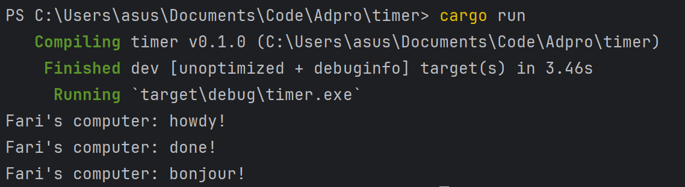
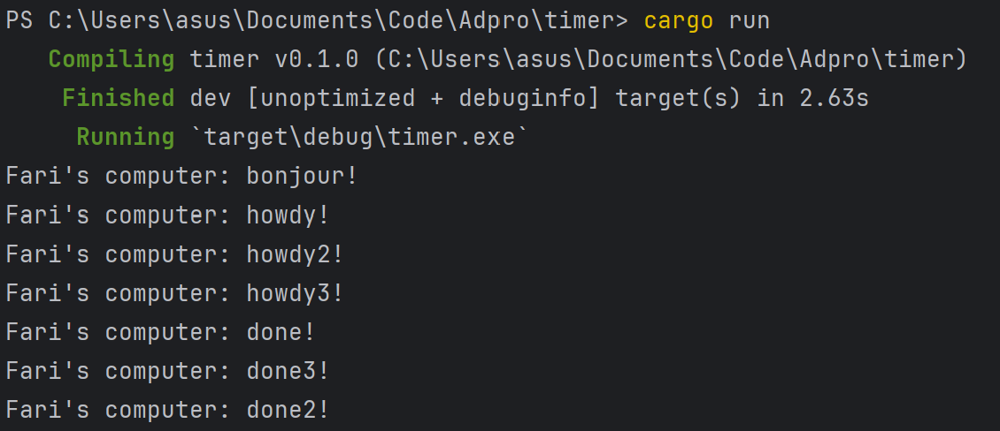
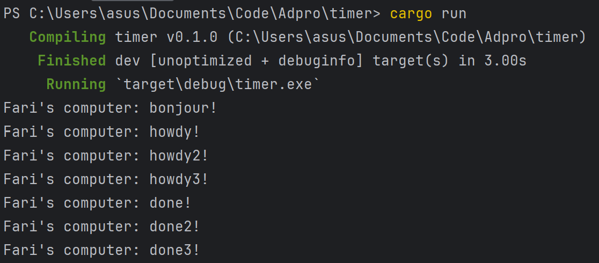

> Fari Hafizh Ramadhan - 2206083691

# Modul 10: Asynchronous Programming

### 1.2 Understanding how it works

Dalam gambar di atas, terlihat bahwa 'bonjour!' diprint terlebih dahulu sebelum 'howdy!' dan 'done!'. Hal ini disebabkan oleh perbedaan dalam penjadwalan eksekusi. 'howdy' dan 'done' dicetak dalam sebuah task yang dipicu oleh spawner.spawn(async { ... }), yang berjalan secara asinkronus setelah executor.run(). Sementara itu, 'bonjour!' dicetak langsung di dalam thread utama tanpa menunggu executor.run(). Inilah yang menyebabkan urutan output seperti yang terlihat.

### 1.3 Experiment 1.3: Multiple Spawn and removing drop
Dengan Drop:

Tanpa Drop:

Dalam gambar di atas, kita bisa melihat output yang dihasilkan dari penggunaan multiple spawn serta perbedaan efek antara menggunakan perintah drop dan tidak. Meskipun outputnya tetap dicetak setelah 'bonjour' dari thread utama, urutan eksekusi tidak teratur karena setiap task berjalan secara asinkronus dan tidak tergantung satu sama lain. Selain itu, ketika perintah drop tidak dihapus, program tidak selesai dan terus berjalan. Hal ini disebabkan oleh fakta bahwa tanpa perintah drop, executor tidak akan mengetahui bahwa tidak ada lagi task yang perlu dijalankan, sehingga executor akan tetap menunggu task baru untuk dieksekusi.